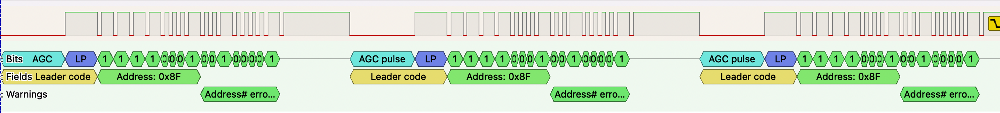
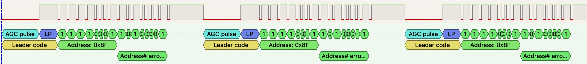
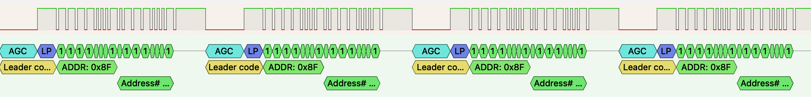

For the following screenshots, ignore the decoder underneath the digital waveform. The decoder is incorrect. We have to manually interpret bits

## Volume Up

## Volume Down

## Mute

Packets seem to be repeated 3 times with a short gap between

# LIMITATIONS:

(Most) JVC/KENWOOD units have a limit on holding the volume+ button. The volume only auto incremements up to
volume 15. After that, the user must press the volume+ button with significant delay between each press to
keep increasing the volume.

As a work around, we use a 175ms delay between volume+ packets. This results in the volume increasing steadily.
This does however come with drawbacks. There can be "missed steps" when the user spins the volume knob fast.
This occurs as the minimum allowed latency is 175ms between each action. However, this is a usable system
