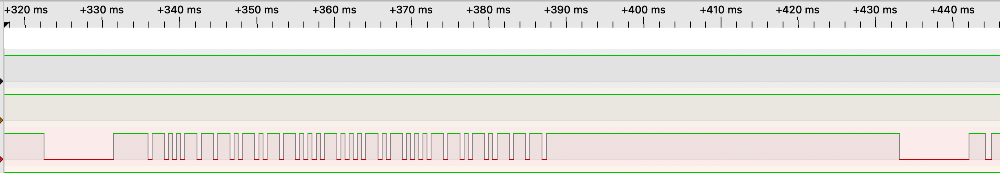
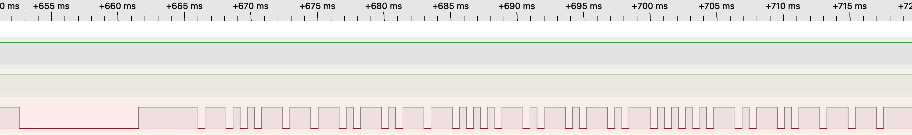
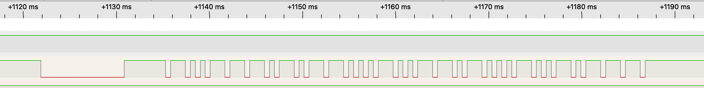

---

530us bit transmission
Logic 0: 530us low, 530us high
Logic 1: 530us low, 3x530us high

---

---

New Packets:

Preamble:
9ms low
4.5ms high

Address 0xB9 (LSB)
Inverted Address 0x46 (LSB)

Command (LSB)
Inverted Command (LSB)

---

---

Repeated Packet:
9ms low
2.1ms high
790us low

---

Command | Inverted Command:
Volume+: 0x14 | 0xEB
Volume-: 0x15 | 0x57
Mute: 0x16 | 0xE9

---

## Volume Up

## Volume Down

## Mute

